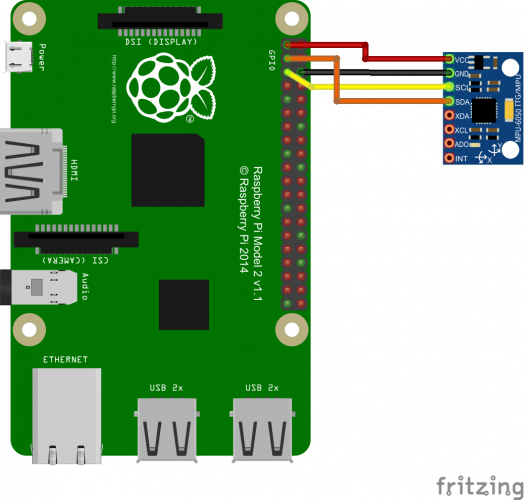

# MPU9250 (I2C bus)
MPU9250 Accelerometer, Gyroscope and Magnetometer, Temperature
Raspbery Pi C library for communicating with the [MPU-9250](https://www.invensense.com/products/motion-tracking/9-axis/mpu-9250/) and MPU-9255 nine-axis Inertial Measurement Units (IMU).

# Description
The InvenSense MPU-9250 is a System in Package (SiP) that combines two chips: the MPU-6500 three-axis gyroscope and three-axis accelerometer; and the AK8963 three-axis magnetometer. The MPU-9250 supports I2C, up to 400 kHz, and SPI communication, up to 1 MHz for register setup and 20 MHz for data reading. The following selectable full scale sensor ranges are available:

| Gyroscope Full Scale Range | Accelerometer Full Scale Range | Magnetometer Full Scale Range |
| --- | --- | ---  |
| +/- 250 (deg/s)  | +/- 2 (g)  | +/- 4800 (uT) |
| +/- 500 (deg/s)  | +/- 4 (g)  | |
| +/- 1000 (deg/s) | +/- 8 (g)  | |
| +/- 2000 (deg/s) | +/- 16 (g) | |

The MPU-9250 samples the gyroscopes, accelerometers, and magnetometers with 16 bit analog to digital converters. It also features programmable digital filters, a precision clock, an embedded temperature sensor, programmable interrupts (including wake on motion).

### Usage
This library supports only I2C bus for commmunication with the MPU-9250.

## Installation
Simply clone or download this library into your project folder.

## I2C

The MPU-9250 pins should be connected as:
   * VDD: this should be a 2.4V to 3.6V power source.
   * GND: ground.
   * VDDI: digital I/O supply voltage. This should be between 1.71V and VDD.
   * FSYNC: not used, should be grounded.
   * INT: (optional) used for the interrupt output setup in *enableDataReadyInterrupt* and *enableWakeOnMotion*. Connect to interruptable pin on microcontroller.
   * SDA / SDI: connect to SDA.
   * SCL / SCLK: connect to SCL.
   * AD0 / SDO: ground to select I2C address 0x68. Pull high to VDD to select I2C address 0x69.
   * nCS: no connect.
   * AUXDA: not used.
   * AUXCL: not used.

4.7 kOhm resistors should be used as pullups on SDA and SCL, these resistors should pullup with a 3.3V source.
